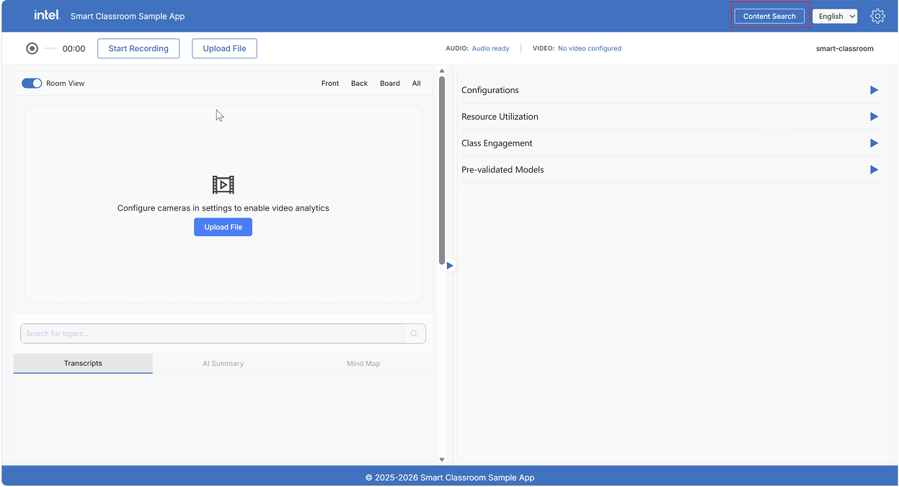
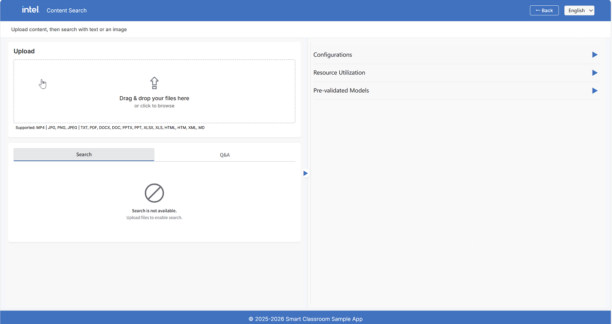
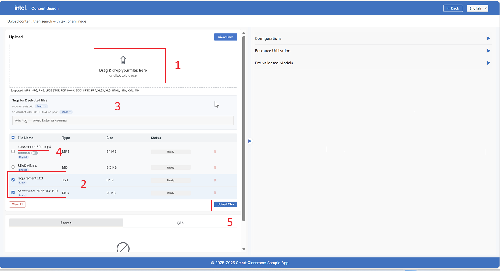
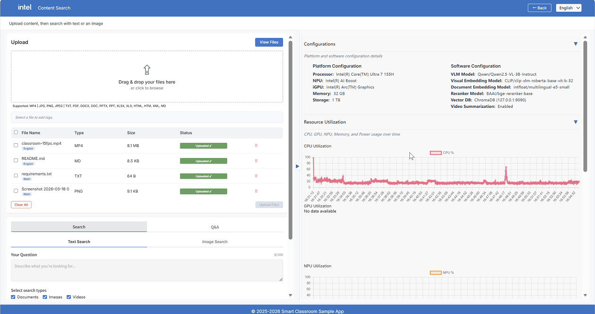
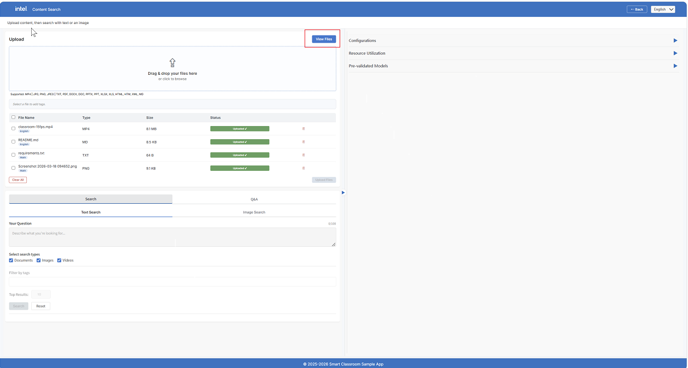
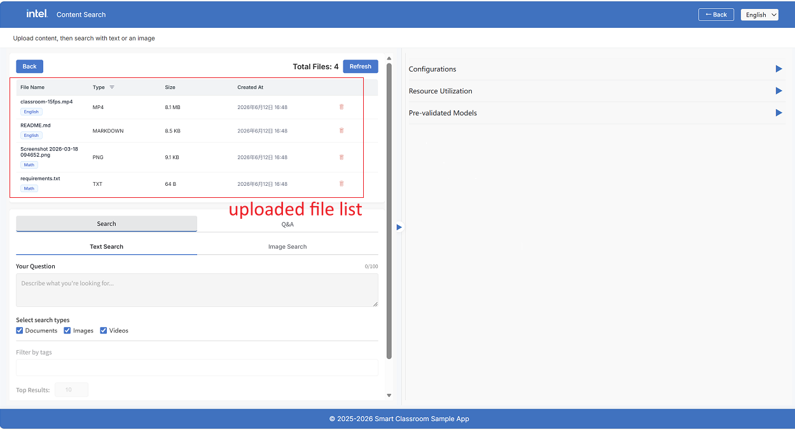
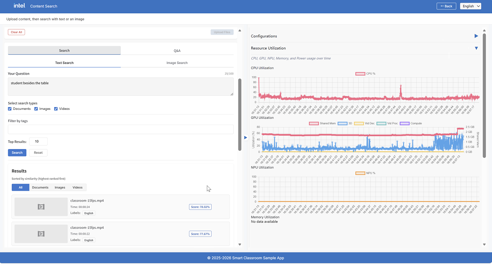
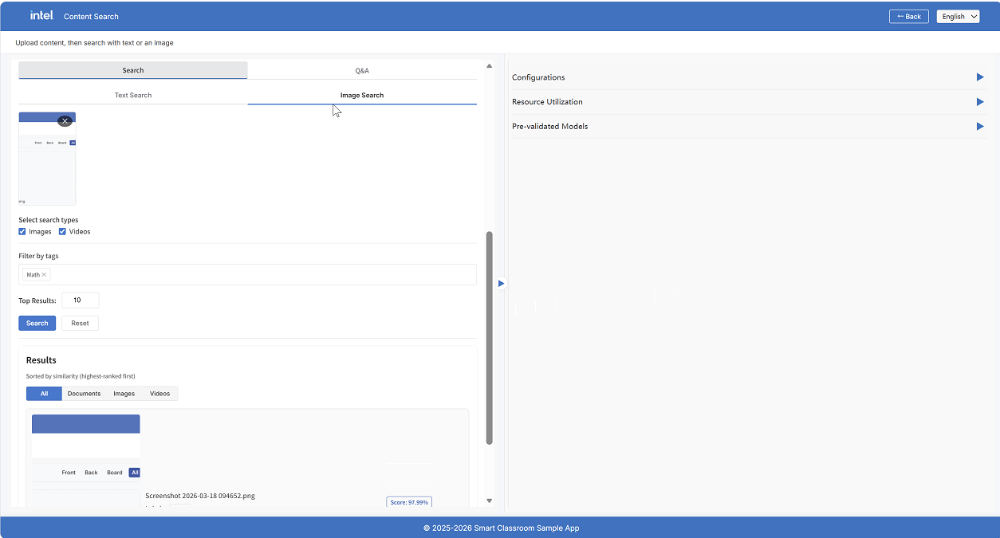
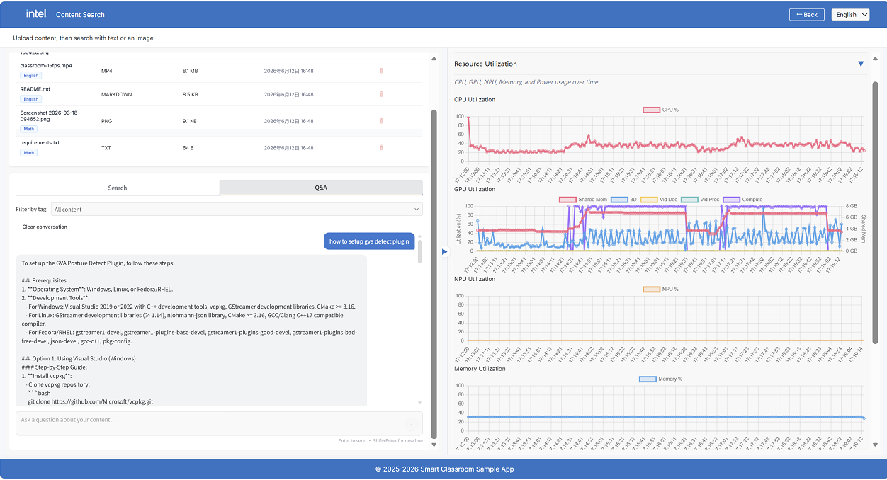
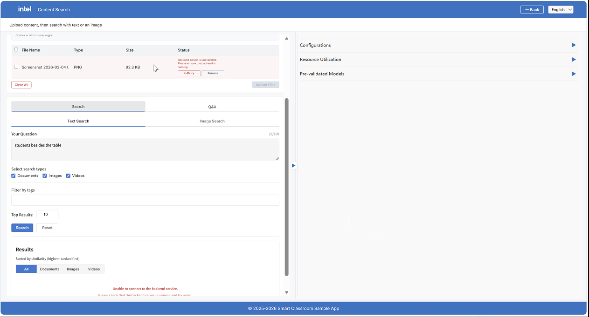

# Content Search Flow

The Content Search feature supports file upload and ingestion, multimodal search (text and
image queries), and Q&A over retrieved content. To enter the Content Search view, click the
**Content Search** button in the top navigation bar of the Smart Classroom main screen.

The Content Search view page is split into two panels:

**Left Panel**

- **Upload** — Ingest files (videos, documents, images) into the vector database
- **Search & Q&A** — Query your uploaded content using text or image search, or ask natural-language questions
- **Results** — Display search results with type filtering, relevance scores, and content previews

**Right Panel**

- **Configuration Metrics** — Platform and software configuration for Content Search services
- **Resource Utilization** — Live monitoring of CPU, GPU, Memory, and Power utilization
- **Models** — Models used by Content Search, including VLM, Visual Embedding, Document Embedding, and Reranker

## Step 1: Upload Files

Click the upload area or drag-and-drop files into the drop zone.

The annotated steps above:

1. **Drag & drop** files or click to browse
2. **Select files** using checkboxes to manage tags
3. **Add tags** to selected files (before upload)
4. **Video options** — toggle Summarize for MP4 files
5. **Search & Q&A tabs** — available after upload completes

Supported file formats:

| Type | Formats |
| :--- | :--- |
| Video | `.mp4` |
| Document | `.pdf`, `.docx`, `.doc`, `.pptx`, `.ppt`, `.xlsx`, `.xls`, `.txt`, `.html`, `.htm`, `.xml`, `.md` |
| Image | `.jpg`, `.jpeg`, `.png` |

### Tagging Files

Before uploading, you can add tags to organize your content:

1. Select one or more files using the checkboxes in the file table
2. Type a tag in the tag input field and press **Enter** or **comma** to add it
3. Tags appear as chips that can be removed by clicking **×**

> **Note:** Tags can only be added or removed while a file is in the **Staged** state (before upload). Once uploaded, tags are locked.

### Video Summarization Toggle

For `.mp4` files, a **Summarize** toggle appears next to the file name. When enabled, the system uses a Vision Language Model (VLM) to generate text summaries of video chunks, enabling richer text-based search over video content.

### Uploading

Click the **Upload Files** button at the bottom to start processing all staged files. Each file goes through the ingestion pipeline:

- **Documents** — Text extraction (with OCR for handwritten/scanned content), semantic chunking, and embedding
- **Images** — CLIP embedding for visual similarity search
- **Videos** — Time-based chunking, frame sampling, VLM summarization (if enabled), and both text and visual embedding

The status column shows the current state: Staged → Processing → Completed (or Failed).

### File Manager

Once files have been uploaded, click **View Files** to open the File Manager, which shows all files currently stored on the server.

## Step 2: Search

After at least one file upload is complete, the **Search** tab becomes available.

### Text Search

1. Select the **Text Search** tab
2. Type your query in the text area (max 100 characters)
3. Select the content types to search across: **Documents**, **Images**, **Videos** (any combination)
4. Optionally filter results by tag using the **Filter by tags** dropdown
5. Set the number of **Top Results** to return (default: 10)
6. Click **Search**

Text queries search both the visual collection (CLIP embeddings) and the textual collection (BGE embeddings). Textual results are reranked by a cross-encoder, and results from both modalities are merged using Reciprocal Rank Fusion (RRF).

### Image Search

1. Select the **Image Search** tab
2. Drag-and-drop an image or click to browse (accepts `.jpg`, `.jpeg`, `.png`)
3. Select the content types to search: **Images**, **Videos** (document search is not available for image queries)
4. Optionally filter by tag
5. Click **Search**

Image queries search the visual collection by CLIP similarity, returning visually similar images and video frames.

### Search Results

Results are displayed in a card layout with tabs for filtering by type: **All**, **Documents**, **Images**, **Videos**.

Each result card shows:

- **File name** and type icon
- **Relevance score** (percentage)
- **Page number** (for documents)
- **Timestamp** (for video results, showing the pin time in the video)
- **Raw text / Summary** — expandable text snippet or VLM-generated summary
- **Tags** — associated labels

Click **Reset** to clear all search inputs and results.

## Step 3: Q&A (RAG)

The **Q&A** tab provides a conversational interface for asking questions about your uploaded content.

1. Switch to the **Q&A** tab
2. Optionally select tags to narrow the context using the **Filter by label** selector
3. Type your question in the input area (max 500 characters)
4. Press **Enter** or click the send button

The system retrieves the most relevant chunks from your uploaded content, assembles them as context, and sends them to the VLM to generate a grounded answer. Each response includes:

- **Answer** — The AI-generated response based on your content
- **Sources** — Referenced files with type indicators and location (page number or video timestamp)

The conversation history is maintained within the session, allowing multi-turn follow-up questions. Click **Clear conversation** to reset the chat history.

## Step 4: Health Monitoring

The Content Search panel automatically checks the health of backend services on load. If any service is unreachable or unhealthy, an error message appears indicating:

- Backend unreachable — the Content Search API (port 9011) is not responding
- Upload/search failure — one or more downstream services (File Ingest, Video Preprocess, VLM Serving, ChromaDB) have issues

Upload and search functionality is affected until all services are healthy.

## Microservices

| Service | Port | Role |
| :--- | :---: | :--- |
| Content Search API | 9011 | Orchestrator and public API |
| File Ingest & Retrieve | 9990 | Embedding, indexing, and retrieval |
| Video Preprocess | 8001 | Video chunking and VLM summarization |
| VLM OpenVINO Serving | 9900 | Vision-language model inference |
| ChromaDB | 9090 | Vector database |

## Learn More

- [How It Works — Content Search Pipeline](./how-it-works.md#content-search-pipeline): Technical architecture and design details.
- [Application Flow](./application-flow.md): End-to-end application flow.