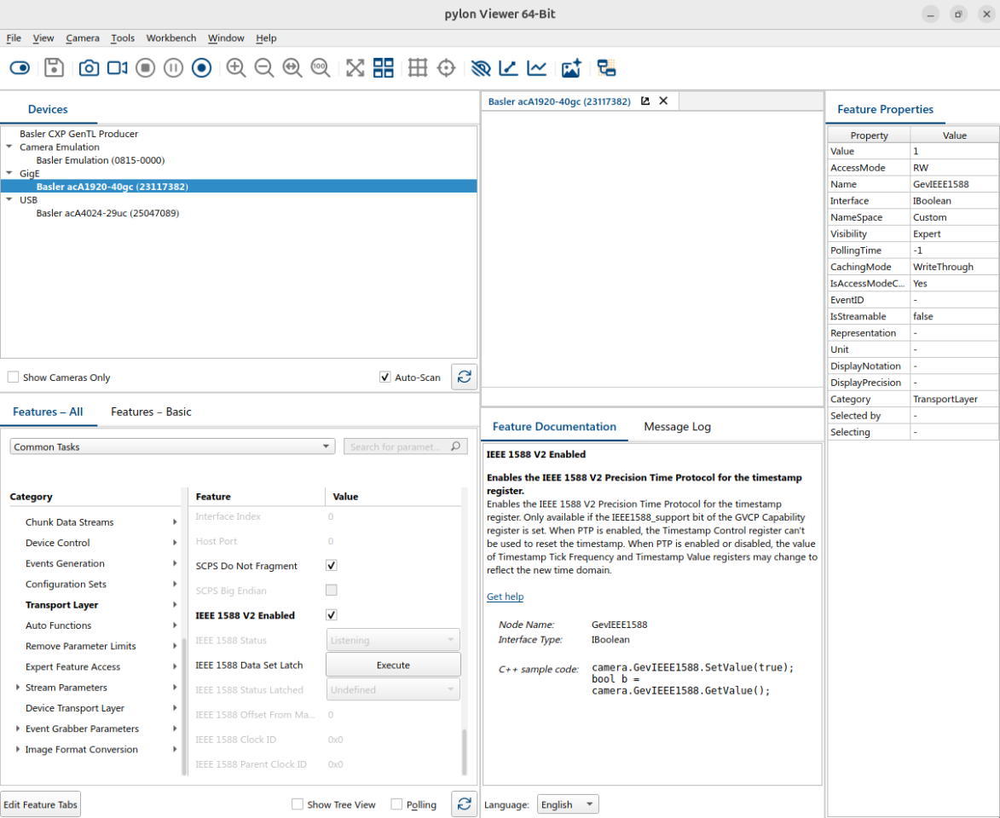

# Configure the Basler Camera to Use PTP Timestamps

This guide explains how to configure the Basler GigE camera to use IEEE 1588v2 PTP hardware timestamping, which provides sub-microsecond time synchronization across the TSN network.

## Prerequisites

Before configuring the camera, ensure:
- The MOXA TSN switch has been configured for IEEE 1588v2 as described in [Configure PTP 1588v2](./configure-ptp-1588v2.md)
- The host has a network interface with an IP address assigned within the camera subnet (for example, `192.168.127.x/24`)
- Basler pylon Viewer is installed on your machine

## Steps

### Step 1: Assign a Static IP Address

Use **pylon IP Configurator** (`Tools > pylon IP Configurator` in pylon Viewer) to assign the camera a static IP address within the same subnet as the TSN switch and host interface (for example, `192.168.127.x/24`).

### Step 2: Enable PTP Timestamping

Open pylon Viewer and enable PTP timestamping under the camera's **PTP** feature group as shown below. This causes the camera to embed a hardware PTP timestamp in every captured frame.

### Step 3: Configure PTP Parameters

In the **PTP** feature group, configure the following settings to match the MOXA switch configuration:

| Parameter | Value |
|-----------|-------|
| Profile | 1588v2 Default Profile |
| Clock Type | Boundary Clock |
| Delay Mechanism | End-to-End |
| Transport Mode | UDP IPv4 |
| Domain Number | 0 |
| Priority 1 | 64 |
| Priority 2 | 128 |

## Verification

Once configured, the camera will synchronize its PTP clock to the MOXA switch Grandmaster. You can verify the sync status in pylon Viewer under the **PTP** feature group — look for a `Synchronized` or `Master` indicator.
