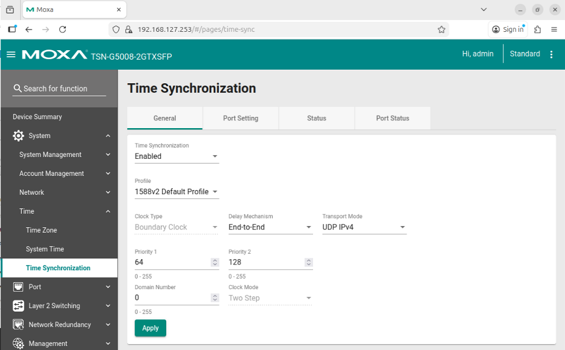

# Configure PTP Time Synchronization (IEEE 1588v2)

## What is IEEE 1588v2 PTP?

IEEE 1588v2 Precision Time Protocol (PTP) provides sub-microsecond time synchronization
across Ethernet devices using standard UDP transport. It is used here instead of IEEE
802.1AS (gPTP) because the Basler GigE camera only supports IEEE 1588v2 over UDP IPv4.

The MOXA TSN switch acts as the **PTP Grandmaster** clock. The host machine running
SceneScape synchronizes its system clock to the switch using the steps below.

## Install PTP Tools

```bash
sudo apt-get update
sudo apt-get install -y linuxptp
```

## Configure the MOXA Switch for 1588v2

By default on resetting the MOXA switch it will be using the 802.1AS (gPTP) profile, so the MOXA switch time-sync profile
must be switched from 802.1AS (gPTP) to 1588v2. Apply the settings shown below:



Key settings:
- **Profile**: IEEE 1588v2 Default Profile
- **Transport Mode**: UDP IPv4
- **PTP Role**: Grandmaster (or Boundary Clock toward the camera port)


## Synchronize the Host Clock

> **Note:** Replace `enp1s0` with the actual network interface name of the Intel i226
> TSN-capable NIC connected to the TSN switch. Also ensure the interface has an IP address
> assigned within the camera subnet before starting `ptp4l`; the UDP transport requires a
> routable address to discover the Grandmaster.

Run the following two commands in **separate terminals**:

1. **Start the PTP daemon (`ptp4l`).**

   `ptp4l` synchronizes the NIC hardware clock (PHC) to the Grandmaster on the switch.
   The `-4` flag selects UDP IPv4 transport, and `-E` selects End-to-End delay
   measurement, matching the camera's 1588v2 Default Profile.

   ```bash
   sudo ptp4l -i enp1s0 -4 -E -s -m --priority1=255 --domain=0
   ```
   ## Important Notes

   - **IP Address on Host Interface:** If you are using VLANs, ensure that your host's network
   interface (e.g., `enp1s0`) has some IP address assigned before
   starting the PTP daemon (`ptp4l`). UDP multicast PTP requires a routable address to
   discover the Grandmaster.

2. **Synchronize the System Clock (`phc2sys`).**

   `phc2sys` keeps the Linux `CLOCK_REALTIME` aligned to the PHC that `ptp4l` is
   disciplining.

   ```bash
   sudo phc2sys -s enp1s0 -c CLOCK_REALTIME --step_threshold=1 -w -m -O 0
   ```

3. **Verify Synchronization.**

   Monitor the `phc2sys` output. Once locked, the offset should be well below 1 µs.
   Example steady-state output:

   ```text
   phc2sys[1234.567]: CLOCK_REALTIME phc offset      42 s2 freq  -1234 delay   512
   ```

   The `s2` state indicates the clock is in continuous tracking mode. An offset below
   ~100 ns is typical on a well-configured TSN network.

