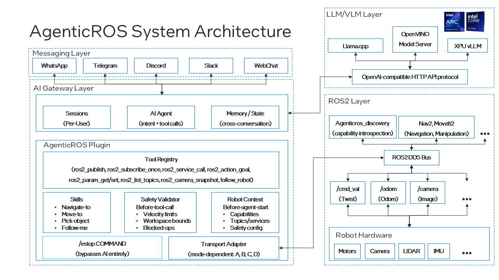
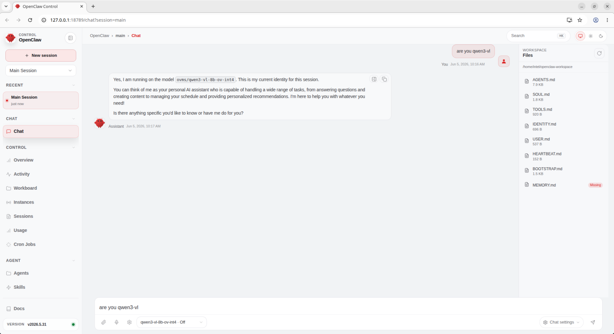
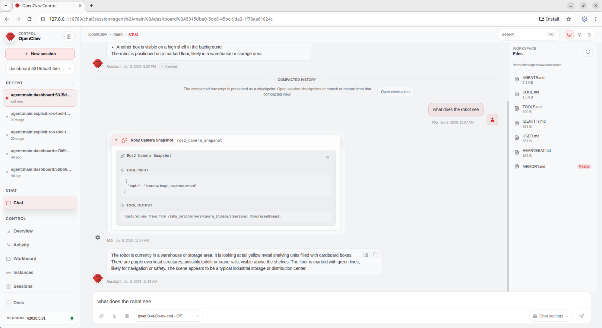

<!--
Copyright (C) 2026 Intel Corporation

SPDX-License-Identifier: Apache-2.0
-->

# OpenClaw + AgenticROS Deployment

This pipeline demonstrates the integration of OpenClaw and AgenticROS AI agent frameworks on Intel PTL (Panther Lake) platform, with LLM/VLM inference served by Intel OpenVINO Model Server (OVMS) for controlling JAKA Kargo robot in a Gazebo simulation environment.

<p align="center">
  <br>
  <em>AgenticROS Architecture: OpenClaw UI → OpenClaw Gateway → AgenticROS Bridge → ROS2 Robot Control</em>
</p>

## Overview

This demo showcases:
- **OpenClaw**: AI agent framework providing natural language interface and tool execution
- **AgenticROS**: AI agent framework that bridges LLM/VLM capabilities with ROS2 robot control
- **Intel OpenVINO Model Server (OVMS)**: Serving Qwen3-VL-8B-Instruct multimodal LLM/VLM on Intel PTL GPU
- **Intel PTL (Panther Lake)**: Hardware platform providing XPU acceleration for AI inference
- **JAKA Kargo Robot**: 6-DOF collaborative robot arm simulation
- **AWS Small Warehouse**: Gazebo simulation environment

The system enables natural language control of the robot, including:
- Camera snapshot capture and analysis
- Linear movement commands with closed-loop odometry control
- Real-time visual feedback in OpenClaw UI

## Prerequisites

### System Requirements
- Ubuntu 24.04 LTS (tested on Ubuntu 24.04 LTS)
- Intel GPU with OpenVINO support (Intel PTL iGPU, Intel Arc dGPU)
- Docker installed and running
- At least 32GB RAM
- 100GB free disk space for models and environments

### Software Requirements
- ROS2 Jazzy
- Python 3.12+
- Intel oneAPI Base Toolkit (for XPU support)
- Gazebo simulation environment
- Node.js 22.19.0+ (for OpenClaw)

## Installation

> Path note: this guide uses `~/edge-ai-suites/...` as an example checkout root. If you cloned the repository elsewhere, replace those paths with your local repository root.

### 0. Clone Deployment Repository

First, clone this deployment folder with all submodules:

```bash
# Clone the edge-ai-suites repository (if not already done)
cd ~
git clone https://github.com/open-edge-platform/edge-ai-suites.git

# Navigate to the deployment folder
cd ~/edge-ai-suites/robotics-ai-suite/pipelines/openclaw-agenticros-demo

# Initialize all submodules
git submodule update --init --recursive

# Verify submodules are checked out
ls -la agenticros openclaw JAKA_KARGO aws-robomaker-small-warehouse-world
```

**Submodules included:**
- `agenticros` - Pinned to commit `675f108` (base commit before patches)
- `openclaw` - Pinned to commit `637b073` (latest stable release)
- `JAKA_KARGO` - Pinned to commit `f2f34f2` (Update Isaac Sim package)
- `aws-robomaker-small-warehouse-world` - Pinned to commit `ee0af73` (Fix launch files for using gazebo_ros)

### 1. Intel OpenVINO Model Server Setup

#### Download Qwen3-VL Model

```bash
# Create Hugging Face environment
python3 -m venv ~/env_hf
source ~/env_hf/bin/activate
pip install -U "huggingface_hub[cli]"

# Download Qwen3-VL-8B-Instruct model
# Login is not required for the public download used in this setup
export HF_ENDPOINT="https://hf-mirror.com"
mkdir -p ~/models
cd ~/models
hf download Qwen/Qwen3-VL-8B-Instruct --local-dir qwen3-vl-8b-instruct

# Deactivate Hugging Face environment
deactivate
```

#### Convert Model to OpenVINO Format

```bash
# Create Python virtual environment for OpenVINO conversion
python3 -m venv ~/env_openvino
source ~/env_openvino/bin/activate

# Install OpenVINO conversion tools from requirements file
# Use the included requirements file (or download from robot-claw repo)
pip install -r ~/edge-ai-suites/robotics-ai-suite/pipelines/openclaw-agenticros-demo/requirements/qwen3_vl_openvino_requirements.txt --extra-index-url https://download.pytorch.org/whl/cpu

# Convert the model
optimum-cli export openvino \
  --model ~/models/qwen3-vl-8b-instruct \
  --task image-text-to-text \
  --weight-format int4 \
  --group-size 128 \
  --ratio 0.8 \
  --trust-remote-code \
  ~/models/qwen3-vl-8b-ov-int4

# Verify conversion
ls ~/models/qwen3-vl-8b-ov-int4/
# Expected: openvino_model.xml, openvino_model.bin, config.json, etc.

# Deactivate virtual environment after conversion
deactivate
```

**Requirements File Contents:**
The `qwen3_vl_openvino_requirements.txt` includes:
- `openvino==2025.4.0` - Intel OpenVINO toolkit
- `optimum` and `optimum-intel` - Hugging Face model conversion tools
- `nncf==3.1.0` - Neural Network Compression Framework
- `transformers==5.0.0` - Hugging Face transformers

**Validated on this host:** the public model download worked without Hugging Face login. If your environment enforces model access control, authenticate before downloading.
- `qwen-vl-utils==0.0.14` - Qwen VL utilities
- Additional dependencies for model conversion and quantization

#### Start OpenVINO Model Server

```bash
# Set target device for your platform
# Arc A770 example: GPU.1
# PTL example: GPU.0
export TARGET_DEVICE=GPU.0

# Navigate to models directory
cd ~/models

# Pull OVMS Docker image (OVMS 2026.1 or later required for Qwen3-VL)
docker pull openvino/model_server:latest-gpu

> Note: if the image pull times out behind a corporate proxy, configure the Docker daemon proxy before retrying.

# Start OVMS container
docker run -d --rm \
  --name ovms-qwen3-vl \
  -u 0 \
  --device /dev/dri \
  -v $(pwd):/models:rw \
  -p 8000:8000 \
  openvino/model_server:latest-gpu \
  --model_path /models/qwen3-vl-8b-ov-int4 \
  --model_name qwen3-vl-8b-ov-int4 \
  --rest_port 8000 \
  --target_device "$TARGET_DEVICE" \
  --task text_generation \
  --tool_parser hermes3

# Verify OVMS is running
docker logs ovms-qwen3-vl 2>&1 | grep -E "Started|Loaded"

# Quick functional test (set NO_PROXY to bypass proxy for localhost)
export NO_PROXY="localhost,127.0.0.0/8"

curl -s http://localhost:8000/v3/chat/completions \
  -H "Content-Type: application/json" \
  -d '{
    "model": "qwen3-vl-8b-ov-int4",
    "max_tokens": 30,
    "temperature": 0,
    "stream": false,
    "messages": [
      { "role": "system", "content": "You are a helpful assistant." },
      { "role": "user", "content": "What are the 3 main tourist attractions in Paris?" }
    ]
  }' | jq .

# The output should be like:
{
  "choices": [
    {
      "finish_reason": "length",
      "index": 0,
      "logprobs": null,
      "message": {
        "content": "While Paris has countless iconic sights, three of the **most famous and must-see tourist attractions** are:\n\n1. **The Eiffel Tower",
        "role": "assistant",
        "tool_calls": []
      }
    }
  ],
  "created": 1780986249,
  "model": "qwen3-vl-8b-ov-int4",
  "object": "chat.completion",
  "usage": {
    "prompt_tokens": 30,
    "completion_tokens": 30,
    "total_tokens": 60
  }
}

# Tool-calling validation (OpenAI-compatible)
# Step 1: Request a tool call and confirm finish_reason is "tool_calls"
curl -sS http://localhost:8000/v3/chat/completions \
  -H "Content-Type: application/json" \
  -d '{
    "model": "qwen3-vl-8b-ov-int4",
    "stream": false,
    "temperature": 0,
    "max_tokens": 128,
    "messages": [
      { "role": "system", "content": "You are a helpful assistant. If tools are provided and relevant, call one." },
      { "role": "user", "content": "What is the weather in Boston? Use the weather tool." }
    ],
    "tools": [
      {
        "type": "function",
        "function": {
          "name": "get_weather",
          "description": "Get current weather by city",
          "parameters": {
            "type": "object",
            "properties": {
              "city": { "type": "string" }
            },
            "required": ["city"]
          }
        }
      }
    ],
    "tool_choice": "auto"
  }' | jq .

# Step 2: Send a tool result and confirm the assistant returns a final text response
curl -sS http://localhost:8000/v3/chat/completions \
  -H "Content-Type: application/json" \
  -d '{
    "model": "qwen3-vl-8b-ov-int4",
    "stream": false,
    "temperature": 0,
    "max_tokens": 128,
    "messages": [
      { "role": "system", "content": "You are a helpful assistant." },
      { "role": "user", "content": "What is the weather in Boston? Use the weather tool." },
      {
        "role": "assistant",
        "content": "",
        "tool_calls": [
          {
            "id": "call_1",
            "type": "function",
            "function": {
              "name": "get_weather",
              "arguments": "{\"city\":\"Boston\"}"
            }
          }
        ]
      },
      {
        "role": "tool",
        "tool_call_id": "call_1",
        "content": "{\"city\":\"Boston\",\"temp_c\":9,\"condition\":\"Cloudy\"}"
      }
    ]
  }' | jq .
```

**📝 OVMS Configuration Notes:**
- **Version**: Use `openvino/model_server:latest-gpu` (OVMS 2026.1+) for Qwen3-VL support
- **Port 8000**: REST endpoint for OpenAI-compatible API (v3/chat/completions)
- **`-u 0`**: Run as root user to avoid permission issues
- **`--target_device`**: Specify GPU device (GPU.0, GPU.1, etc.)
- **`--task text_generation`**: Required parameter for text generation models
- **`--tool_parser hermes3`**: Enable tool calling support for OpenClaw integration
- **Model repository**: OVMS loads models from the mounted `/models` directory
- **Read-write mount**: Use `:rw` to allow OVMS to write cache files

### 2. OpenClaw Setup

#### Install OpenClaw

```bash
# Ensure Node.js 22.19.0+ is installed
node --version  # Should be >= v22.19.0

# If Node.js version is too old, install/upgrade using one of these methods:

# Method 1: Using NodeSource repository (recommended)
curl -fsSL https://deb.nodesource.com/setup_22.x | sudo -E bash -
sudo apt-get install -y nodejs

# Method 2: Using nvm (Node Version Manager)
# curl -o- https://raw.githubusercontent.com/nvm-sh/nvm/v0.40.0/install.sh | bash
# source ~/.bashrc
# nvm install 22
# nvm use 22

# Initialize and checkout OpenClaw submodule
cd ~/edge-ai-suites/robotics-ai-suite/pipelines/openclaw-agenticros-demo
git submodule update --init openclaw

# Install dependencies and build (requires Node.js 22.19.0+)
cd openclaw

# Install pnpm if not already installed
npm install -g pnpm

# Install dependencies and build OpenClaw
pnpm install
pnpm build

# Install OpenClaw CLI globally (allows 'openclaw' command from any terminal)
npm install -g .

# Run OpenClaw onboarding (initial setup - creates ~/.openclaw/openclaw.json)
# This interactive wizard guides you through:
# - Gateway setup (authentication, port configuration)
# - Workspace directory configuration
# - Channel and skill setup
openclaw onboard

# After onboarding completes, configure OpenClaw for Intel OVMS backend
# OpenClaw creates ~/.openclaw/openclaw.json by default during installation
# Update the configuration to add OVMS provider

# Backup existing config
cp ~/.openclaw/openclaw.json ~/.openclaw/openclaw.json.backup

# Update the configuration (merge with existing content)
cat > ~/.openclaw/openclaw.json << 'EOF'
{
  "models": {
    "providers": {
      "ovms": {
        "baseUrl": "http://127.0.0.1:8000/v3",
        "apiKey": "",
        "api": "openai-completions",
        "models": [
          {
            "id": "qwen3-vl-8b-ov-int4",
            "name": "qwen3-vl-8b-ov-int4",
            "reasoning": false,
            "input": ["text", "image"],
            "cost": { "input": 0, "output": 0, "cacheRead": 0, "cacheWrite": 0 },
            "contextWindow": 32768,
            "maxTokens": 4096
          }
        ]
      }
    }
  },
  "agents": {
    "defaults": {
      "workspace": "~/openclaw-workspace",
      "model": { "primary": "ovms/qwen3-vl-8b-ov-int4" }
    }
  }
}
EOF

# Set no_proxy for OpenClaw gateway to bypass proxy for localhost
mkdir -p ~/.config/systemd/user/openclaw-gateway.service.d

cat > ~/.config/systemd/user/openclaw-gateway.service.d/no_proxy.conf << 'EOF'
[Service]
Environment="NO_PROXY=localhost,127.0.0.1,::1,172.16.0.0/12,192.168.0.0/16,host.docker.internal"
Environment="no_proxy=localhost,127.0.0.1,::1,172.16.0.0/12,192.168.0.0/16,host.docker.internal"
EOF

# Apply gateway configuration
systemctl --user daemon-reload
systemctl --user restart openclaw-gateway
systemctl --user status openclaw-gateway

# Verify OpenClaw gateway is running
# Check that the service is active and no_proxy is applied
systemctl --user show openclaw-gateway | grep -E "NO_PROXY|no_proxy"

# Verify gateway is accessible (should return gateway info or 404, not connection refused)
curl -s http://127.0.0.1:18789/ | head -5
```

**Verification Checklist:**
- ✅ OVMS serving endpoint responds on `http://127.0.0.1:8000`
- ✅ OpenClaw gateway service is active and running
- ✅ no_proxy override is active for OpenClaw gateway (check systemctl show output)
- ✅ Gateway is accessible on `http://127.0.0.1:18789` (curl returns response, not connection refused)

**📌 Important Configuration Notes:**
- The above configuration shows only the OVMS-related sections
- **no_proxy setting**: Required for OpenClaw to connect to OVMS (localhost:8000) and rosbridge (localhost:9090) without proxy interference
- OpenClaw creates a default config during installation - always backup before modifying
- `baseUrl`: Points to OVMS v3 API endpoint (http://127.0.0.1:8000/v3)
- `api`: Set to `openai-completions` for OpenAI-compatible API
- `input`: Must include `["text", "image"]` for multimodal support (critical for camera snapshots)
- `model.primary`: Uses `ovms/` provider prefix to reference the OVMS provider
- Keep existing `gateway`, `auth`, and other fields when merging with default configuration
- If you have an existing config with other providers, add the `ovms` section under `models.providers`

### 3. ROS2 Jazzy Setup

Follow the [official ROS2 Jazzy installation](https://docs.ros.org/en/jazzy/Installation/Ubuntu-Install-Debs.html) to install ROS2 base system.

After base ROS2 installation, install simulation dependencies:

```bash
# Install required ROS2 packages for AgenticROS with Gazebo simulation
sudo apt update
sudo apt install -y \
  python3-colcon-common-extensions \
  ros-jazzy-ros-gz \
  ros-jazzy-ros-gz-sim \
  ros-jazzy-rosbridge-suite \
  ros-jazzy-control-msgs \
  ros-jazzy-moveit-msgs \
  ros-jazzy-moveit-ros-planning-interface \
  ros-jazzy-moveit-visual-tools \
  ros-jazzy-rviz2

> Note: the launch files in this demo use Gazebo Sim through `ros_gz_sim`, so `ros-jazzy-ros-gz-sim` and `ros-jazzy-rosbridge-suite` must be installed. On the validation host.

# Verify ROS2 installation
source /opt/ros/jazzy/setup.bash
ros2 pkg list | grep -E "gz|rosbridge"
```

### 4. AgenticROS Setup

Initialize and build the AgenticROS workspace:

```bash
# Initialize and checkout AgenticROS submodule (pinned to commit 675f108)
cd ~/edge-ai-suites/robotics-ai-suite/pipelines/openclaw-agenticros-demo
git submodule update --init agenticros

# Apply patches for JAKA Kargo and warehouse features (4 patches in sequence)
cd agenticros

# Method 1: Apply with git am (preserves commit history)
git am ../patches/agenticros/*.patch

# Method 2: Apply without committing (if git am fails due to shallow clone)
# for patch in ../patches/agenticros/*.patch; do
#   echo "Applying $(basename $patch)..."
#   git apply "$patch"
# done

# Initialize and setup JAKA_KARGO submodule
cd ~/edge-ai-suites/robotics-ai-suite/pipelines/openclaw-agenticros-demo
git submodule update --init JAKA_KARGO

# Apply JAKA_KARGO patches (1 patch for Gazebo integration)
cd JAKA_KARGO
git am ../patches/jaka_kargo/*.patch

# Initialize and setup aws-robomaker-small-warehouse-world submodule
cd ~/edge-ai-suites/robotics-ai-suite/pipelines/openclaw-agenticros-demo
git submodule update --init aws-robomaker-small-warehouse-world

# Apply aws-robomaker-small-warehouse-world patches (1 patch for model URI updates)
cd aws-robomaker-small-warehouse-world
git am ../patches/aws_warehouse_world/*.patch

# Link both JAKA_KARGO and aws-robomaker-small-warehouse-world to AgenticROS ROS2 workspace
cd ~/edge-ai-suites/robotics-ai-suite/pipelines/openclaw-agenticros-demo/agenticros/ros2_ws/src
ln -sf ~/edge-ai-suites/robotics-ai-suite/pipelines/openclaw-agenticros-demo/JAKA_KARGO/jaka_kargo_ros2/src/jaka_kargo_description .
ln -sf ~/edge-ai-suites/robotics-ai-suite/pipelines/openclaw-agenticros-demo/aws-robomaker-small-warehouse-world .

# Install Node.js dependencies and build TypeScript packages
cd ~/edge-ai-suites/robotics-ai-suite/pipelines/openclaw-agenticros-demo/agenticros
pnpm install

# Build the packages for OpenClaw plugin integration
pnpm --filter @agenticros/core build
pnpm --filter @agenticros/ros-camera build

# Run TypeScript type checking to verify the build
pnpm typecheck

# Build ROS2 workspace (including JAKA_KARGO and warehouse world)
cd ros2_ws
source /opt/ros/jazzy/setup.bash
colcon build --packages-select agenticros_msgs agenticros_bringup agenticros_discovery agenticros_agent agenticros_follow_me jaka_kargo_description aws_robomaker_small_warehouse_world
source install/setup.bash

# Source the workspace in bashrc for future sessions
echo "source ~/edge-ai-suites/robotics-ai-suite/pipelines/openclaw-agenticros-demo/agenticros/ros2_ws/install/setup.bash" >> ~/.bashrc
```

**Key packages in the AgenticROS workspace:**
- `agenticros_agent`: Core agent logic for AI-ROS bridging
- `agenticros_bringup`: Launch files for bringing up robot simulations
- `agenticros_msgs`: Custom ROS2 message definitions
- `agenticros_discovery`: ROS service/topic discovery for AI agents
- `jaka_kargo_description`: JAKA Kargo robot URDF, meshes, and Gazebo launch files (from JAKA_KARGO submodule)
- `aws_robomaker_small_warehouse_world`: AWS Small Warehouse Gazebo environment (from aws-robomaker-small-warehouse-world submodule)

#### Configure OpenClaw System Service with ROS2 Environment

OpenClaw gateway must load ROS2 environment to access AgenticROS plugin tools. Create a wrapper script and systemd override:

```bash
# Create wrapper script that sources ROS2 environment
mkdir -p ~/.local/bin

cat > ~/.local/bin/openclaw-gateway-with-ros.sh << 'EOF'
#!/usr/bin/env bash
set -eo pipefail

source /opt/ros/jazzy/setup.bash
source ~/edge-ai-suites/robotics-ai-suite/pipelines/openclaw-agenticros-demo/agenticros/ros2_ws/install/setup.bash

exec openclaw gateway
EOF

chmod +x ~/.local/bin/openclaw-gateway-with-ros.sh

# Create systemd override to use the wrapper and set ROS environment
mkdir -p ~/.config/systemd/user/openclaw-gateway.service.d

cat > ~/.config/systemd/user/openclaw-gateway.service.d/ros-env.conf << 'EOF'
[Service]
Environment="ROS_DISTRO=jazzy"
Environment="RMW_IMPLEMENTATION=rmw_fastrtps_cpp"
ExecStart=
ExecStart=%h/.local/bin/openclaw-gateway-with-ros.sh
EOF

# Reload and restart gateway
systemctl --user daemon-reload
systemctl --user restart openclaw-gateway.service
systemctl --user is-active openclaw-gateway.service
# Expected: active

# Verify ROS environment is loaded
systemctl --user show openclaw-gateway.service --property=Environment | grep ROS_DISTRO
# Expected: ROS_DISTRO=jazzy
```

#### Configure OpenClaw Plugin for AgenticROS

Run the helper script to configure AgenticROS plugin:

```bash
cd ~/edge-ai-suites/robotics-ai-suite/pipelines/openclaw-agenticros-demo/agenticros
./scripts/setup_gateway_plugin.sh

# Restart gateway to load plugin configuration
systemctl --user daemon-reload
systemctl --user restart openclaw-gateway.service
```

**Required Plugin Configuration in `~/.openclaw/openclaw.json`:**

The helper script adds this configuration (or add manually if needed):

```json
{
  "plugins": {
    "entries": {
      "agenticros": {
        "enabled": true,
        "config": {
          "transport": {
            "mode": "rosbridge"
          },
          "rosbridge": {
            "url": "ws://localhost:9090",
            "reconnect": true,
            "reconnectInterval": 3000
          },
          "robot": {
            "name": "Robot",
            "namespace": "",
            "cameraTopic": "/camera/image_raw"
          },
          "teleop": {
            "cameraTopic": "/camera/image_raw",
            "cmdVelTopic": "/cmd_vel_unstamped",
            "speedDefault": 0.3,
            "cameraPollMs": 150
          },
          "safety": {
            "maxLinearVelocity": 1,
            "maxAngularVelocity": 1.5
          }
        }
      }
    },
    "allow": ["agenticros", "memory-core", "vllm"],
    "load": {
      "paths": ["~/edge-ai-suites/robotics-ai-suite/pipelines/openclaw-agenticros-demo/agenticros/packages/agenticros"]
    }
  }
}
```

**📌 Important Notes:**
- Do NOT set `"tools": {"profile": "coding"}` - this hides plugin tools from the model
- Keep `transport.mode` as `"rosbridge"` for this deployment
- Keep `rosbridge.url` as `"ws://localhost:9090"`
- For JAKA simulation, use `cmdVelTopic: "/cmd_vel_unstamped"`

#### Verify OpenClaw ROS2 Tool Calling

Test that OpenClaw can call ROS2 tools through the AgenticROS plugin:

```bash
# Verify ROS2 tools are available (start rosbridge first - see Running the Demo section)
openclaw agent --local --session-id ros-tool-test-$(date +%s) \
  --message "Call ros2_list_topics once." --json

# Check gateway logs for ROS2 transport connection
journalctl --user -u openclaw-gateway.service -n 60 --no-pager | grep -E 'ROS2 transport status|ROS2 transport connected'
# Expected: Should show "ROS2 transport connected" or similar success message
```


## Running the Demo

### Step 1: Start Gazebo Simulation with rosbridge

Launch the JAKA Kargo robot in AWS Small Warehouse environment with integrated rosbridge WebSocket server:

```bash
# Terminal 1: Start ROS2, Gazebo, and rosbridge
source ~/edge-ai-suites/robotics-ai-suite/pipelines/openclaw-agenticros-demo/agenticros/ros2_ws/install/setup.bash

# Launch JAKA Kargo with AWS Warehouse and rosbridge
ros2 launch agenticros_bringup rosbridge_gazebo.launch.py \
    gazebo_launch:=gazebo_small_warehouse.launch.py \
    use_gazebo_gui:=true

# Note: `use_gazebo_gui:=true` requires a graphical desktop session with a valid
# display. In pure tty sessions, use `use_gazebo_gui:=false` (or the xvfb path
# in Troubleshooting).

# Wait for Gazebo to fully load (you should see the warehouse and robot)
```

**What this command does:**
- Starts rosbridge WebSocket server on port 9090
- Launches Gazebo with JAKA Kargo robot in AWS Small Warehouse
- Enables Gazebo GUI for visualization (`use_gazebo_gui:=true`)

**Expected result:**
- ✅ Gazebo window opens with AWS Small Warehouse environment
- ✅ JAKA Kargo robot is spawned in the warehouse
- ✅ rosbridge WebSocket server running on port 9090
- ✅ ROS2 topics are available: `/camera/image_raw`, `/cmd_vel`, `/odom`

**Verification:**
```bash
# Terminal 2: Check running topics
ros2 topic list | grep -E "(camera|cmd_vel|odom)"

# Expected output:
# /camera/image_raw
# /camera/image_raw/compressed
# /cmd_vel
# /odom

# Verify rosbridge is running
ss -ltn '( sport = :9090 )'
# Expected: port 9090 is LISTEN
```

**Alternative launch options:**

```bash
# AWS Small Warehouse without GUI (headless mode)
# Use Ogre renderer if Ogre2 render came across crash error.
ros2 launch agenticros_bringup rosbridge_gazebo.launch.py \
    gazebo_launch:=gazebo_small_warehouse.launch.py \
    gazebo_render_engine:=ogre \
    use_gazebo_gui:=false

# AWS Small Warehouse no-roof variant
ros2 launch agenticros_bringup rosbridge_gazebo.launch.py \
    gazebo_launch:=gazebo_small_warehouse.launch.py \
    warehouse_world:=$HOME/edge-ai-suites/robotics-ai-suite/pipelines/openclaw-agenticros-demo/agenticros/ros2_ws/src/aws-robomaker-small-warehouse-world/worlds/no_roof_small_warehouse/no_roof_small_warehouse.world \
    use_gazebo_gui:=true

# If `gz sim` is missing, ensure the Gazebo tools registry path is present.
export GZ_CONFIG_PATH="/opt/ros/jazzy/opt/gz_tools_vendor/share/gz:${GZ_CONFIG_PATH:-}"
```

### Step 2: Start OpenClaw Dashboard

OpenClaw gateway is already running as a systemd service (started during setup). Now start the dashboard UI:

```bash
# Terminal 2: Start OpenClaw dashboard
cd ~/edge-ai-suites/robotics-ai-suite/pipelines/openclaw-agenticros-demo/openclaw
openclaw dashboard

# Expected output will show a URL like:
# OpenClaw dashboard running at: http://localhost:3000
# or http://localhost:XXXX (port may vary)
```

**Open the displayed URL in your web browser** (e.g., http://localhost:3000)

**Verify OpenClaw gateway status (optional):**
```bash
systemctl --user status openclaw-gateway

# Expected: Active: active (running)
```

**Chat with Qwen3-VL in OpenClaw UI**

<p align="center">
  <br>
  <em>Validate the OpenClaw and OVMS setup through the OpenClaw UI chat</em>
</p>

### Step 3: Interact with the Robot

**Open the OpenClaw web UI in your browser using the URL shown by the dashboard command.**

**Try these commands in the OpenClaw interface:**

#### Camera Snapshot
```
What does the robot see
```

**Expected behavior:**
1. ✅ OpenClaw calls AgenticROS `camera_snapshot` tool
2. ✅ AgenticROS subscribes to `/camera/image_raw/compressed`
3. ✅ Image is captured and displayed in OpenClaw UI
4. ✅ Qwen3-VL model analyzes the image and responds with description

<p align="center">
  <br>
  <em>Validate the camera snapshot feature: OpenClaw captures and analyzes the robot's camera view</em>
</p>

#### Movement Commands
```
Move the robot forward 1 meter
```

**Expected behavior:**
1. ✅ OpenClaw calls AgenticROS `cmd_vel_move` tool with `linear: 1.0, distance: 1.0`
2. ✅ AgenticROS publishes to `/cmd_vel` topic
3. ✅ Robot moves forward in Gazebo
4. ✅ AgenticROS monitors `/odom` for closed-loop control
5. ✅ Robot stops after traveling ~1 meter

```
Rotate the robot 90 degrees clockwise
```

**Expected behavior:**
1. ✅ OpenClaw calls `cmd_vel_move` with `angular: -1.57` (radians)
2. ✅ Robot rotates in place in Gazebo
3. ✅ AgenticROS stops robot after 90-degree rotation

## Troubleshooting

### Gazebo Not Starting

**Issue**: `Gazebo fails to start or crashes immediately`

**Solution**:
```bash
# Check Gazebo installation
gazebo --version

# Reset Gazebo configuration
rm -rf ~/.gazebo/
mkdir -p ~/.gazebo/models

# Restore the Gazebo tools registry path if `gz` is missing commands
export GZ_CONFIG_PATH="/opt/ros/jazzy/opt/gz_tools_vendor/share/gz:${GZ_CONFIG_PATH:-}"
source /opt/ros/jazzy/setup.bash
source ~/yy/edge-ai-suites/robotics-ai-suite/pipelines/openclaw-agenticros-demo/agenticros/ros2_ws/install/setup.bash

# Try launching with verbose output
ros2 launch agenticros_bringup rosbridge_gazebo.launch.py \
  gazebo_launch:=gazebo_small_warehouse.launch.py \
  gazebo_render_engine:=ogre \
  use_gazebo_gui:=false \
  --ros-args --log-level debug
```

### OVMS Connection Failed

**Issue**: `OpenClaw cannot connect to OVMS at http://localhost:8000`

**Solution**:
```bash
# Check OVMS container status
docker ps | grep ovms-qwen3-vl

# Check OVMS logs
docker logs ovms-qwen3-vl

# Verify model is loaded
curl http://localhost:8000/v1/models

# Restart OVMS container
docker restart ovms-qwen3-vl
```

### rosbridge Not Responding

**Issue**: `OpenClaw shows "Disconnected from AgenticROS"`

**Solution**:
```bash
# Check rosbridge is running
ps aux | grep rosbridge

# Verify WebSocket port is open
netstat -tuln | grep 9090

# If launch reports "Address already in use", find and stop the existing listener first
ss -ltnp '( sport = :9090 )'

# Restart rosbridge
ros2 launch rosbridge_server rosbridge_websocket_launch.xml
```

### Camera Image Not Displaying

**Issue**: `camera_snapshot tool returns error or image doesn't show in UI`

**Solution**:
```bash
# Check camera topic is publishing
ros2 topic hz /camera/image_raw/compressed

# Manually test camera
ros2 run image_view image_view --ros-args --remap image:=/camera/image_raw

# Check AgenticROS image serving
curl http://localhost:8080/images/latest.jpg
```

### Robot Not Moving

**Issue**: `cmd_vel commands don't move the robot in Gazebo`

**Solution**:
```bash
# Check cmd_vel topic is subscribed
ros2 topic info /cmd_vel

# Manually test movement
ros2 topic pub /cmd_vel geometry_msgs/msg/Twist "{linear: {x: 0.5}, angular: {z: 0.0}}" --once

# Check robot controller is running
ros2 node list | grep controller

# Verify Gazebo physics engine is running
gz physics list
```

### Model Inference Too Slow

**Issue**: `Qwen3-VL takes >10 seconds per response`

**Solution**:
```bash
# Check GPU utilization
intel_gpu_top

# Verify OVMS is using GPU
docker logs ovms-qwen3-vl | grep "Device: GPU"
```